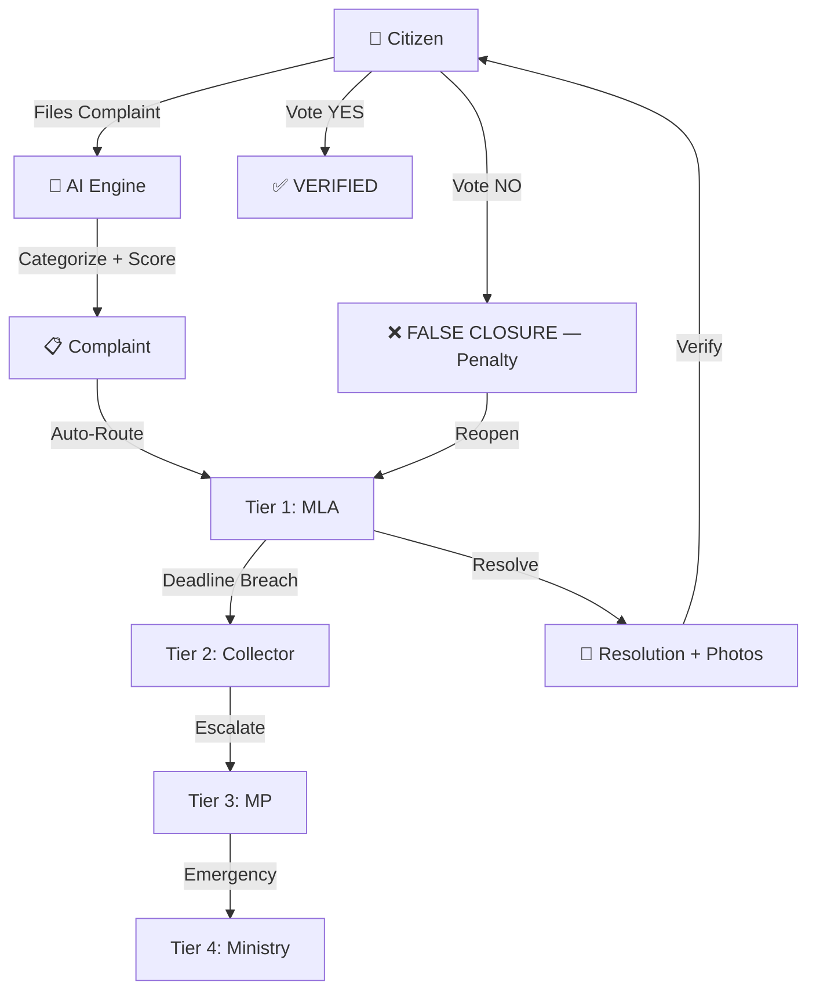

# VANTA — Production-Ready Master Plan

## What You're Building

**VANTA** is a **Governance Intelligence Platform** — an AI-powered civic grievance redressal system that connects **Citizens**, **Ward Officials (MLA)**, **District Collectors**, and **Members of Parliament** in a tiered accountability loop.



### Core Innovation
- **AI Triage**: Gemini-powered complaint categorization + criticality scoring (0-100 scale, 6-tier levels)
- **Star Priority System**: Dynamic 1-5 star rating combining AI score + community upvotes
- **Auto-Escalation**: Breached deadlines automatically reassign up the tier chain with halved response windows
- **Accountability Score**: Officials gain/lose points based on resolution speed and citizen verification
- **Citizen Verification Loop**: Citizens vote on whether resolutions are real — false closures penalize officials

---

## Current State Audit

### ✅ What's Working
| Area | Status | Details |
|------|--------|---------|
| MongoDB Backend | ✅ Working | Custom PyMongo ORM adapter wrapping SQLAlchemy-style syntax |
| Citizen OTP Login | ✅ Working | Phone-based auth with mock OTP (123456) |
| Official Email Login | ✅ Working | Email/password auth for MLA, Collector, MP, Ministry |
| AI Complaint Analysis | ✅ Working | Gemini API + local fallback rules engine |
| Auto-Routing | ✅ Working | Tiered routing based on criticality keywords |
| Complaint CRUD | ✅ Working | Create, read, filter, status update, upvote |
| Resolution + Verification | ✅ Working | Submit resolution → citizen verifies → resolved or reopened |
| Escalation Engine | ✅ Working | Deadline sweep → auto-escalate + penalize |
| Official Dashboard | ✅ Working | Dynamic stats, urgent queue, AI brief panel |
| MLA Dashboard | ✅ Working | Feed of assigned complaints with real API data |
| MP Overview | ✅ Working | Constituency-wide telemetry from API |
| MLA Scoreboard | ✅ Working | Real accountability rankings from API |
| Complaint Detail View | ✅ Working | Dynamic loading + citizen profile card + action buttons |
| Citizen Profile | ✅ Working | Edit name, ward, district, geotag |
| Official Profile | ✅ Working | Edit credentials, view performance telemetry |
| WebSocket Infrastructure | ✅ Working | Connection manager + broadcast in main.py |
| Constituency Map | ⚠️ Partial | Static CSS-drawn map, not using LiveMap/Leaflet |
| LiveMap Component | ⚠️ Partial | Built with Leaflet but not wired into the Constituency page |

### ❌ What's Broken / Missing

| Area | Issue | Impact |
|------|-------|--------|
| Citizen Home page | Placeholder `"Under Construction"` | Dead route |
| Citizen Analytics page | Placeholder `"Under Construction"` | Dead route |
| Escalations page | Uses `mockComplaints.js` hardcoded data | No real data |
| Constituency page | Uses static CSS pins, not Leaflet LiveMap | Fake map |
| Analytics page (Official) | Fully hardcoded mock projects | No real data |
| MP Priority Ranker | Fully hardcoded mock projects | No real data |
| Auth Guards | No route protection at all | Anyone can access any portal by URL |
| JWT Tokens | Fake string tokens, no validation | No security |
| Error Handling | `fetch()` calls don't check `res.ok` in many places | Silent failures |
| `sqlalchemy` import in services | `escalation.py` and `routing.py` import `from sqlalchemy.orm import Session` | Will crash with MongoDB ORM |
| `.env` loading | `python-dotenv` is in requirements but never loaded in `main.py` | ENV vars not read |
| Notifications | WebSocket broadcast exists but is never called after complaint creation | No real-time updates |
| Search | No search functionality anywhere | Can't find complaints |
| Responsive Design | No mobile breakpoints | Broken on phones |
| 404 Page | No catch-all route | White screen on bad URL |

---

## Proposed Changes

### Phase 1 — Critical Backend Fixes

> [!CAUTION]
> These must be fixed before anything else. The app will crash without them.

#### [MODIFY] [main.py](file:///c:/Users/mdawa/OneDrive/Desktop/codes/H2K/backend/main.py)
- Add `from dotenv import load_dotenv; load_dotenv()` at the top so `.env` variables are actually loaded
- After `create_complaint` in complaints route, call `app.state.notify_clients()` to trigger real-time WebSocket broadcasts
- Add a `@app.on_event("startup")` handler for scheduled escalation sweeps using `asyncio`

#### [MODIFY] [escalation.py](file:///c:/Users/mdawa/OneDrive/Desktop/codes/H2K/backend/services/escalation.py)
- Replace `from sqlalchemy.orm import Session` with `from database import get_db` compatible import
- The function signature uses `Session` type hint — change to use the MongoDB session adapter

#### [MODIFY] [routing.py](file:///c:/Users/mdawa/OneDrive/Desktop/codes/H2K/backend/services/routing.py)
- Same `sqlalchemy.orm` import fix as escalation.py
- Replace `Session` type hints with MongoDB-compatible session

#### [MODIFY] [requirements.txt](file:///c:/Users/mdawa/OneDrive/Desktop/codes/H2K/backend/requirements.txt)
- Remove `sqlalchemy` (no longer used with MongoDB)
- Add `python-jose[cryptography]` for real JWT tokens
- Add `passlib[bcrypt]` for password hashing
- Add `apscheduler` for background escalation sweeps

---

### Phase 2 — Authentication & Security Hardening

#### [NEW] `backend/auth/jwt_handler.py`
- Real JWT token generation and validation using `python-jose`
- Token expiry (24 hours for citizens, 8 hours for officials)
- Password hashing with bcrypt instead of plaintext `"password"` comparison

#### [MODIFY] [auth.py](file:///c:/Users/mdawa/OneDrive/Desktop/codes/H2K/backend/routes/auth.py)
- Use real JWT token generation instead of fake string tokens
- Hash passwords on official creation, verify with bcrypt on login
- Add `get_current_user` dependency for protected routes

#### [NEW] `src/services/authGuard.jsx`
- React component wrapping `<Outlet>` that checks `localStorage` for valid token
- Redirects to `/login/citizen` or `/login/official` if not authenticated
- Prevents direct URL navigation to protected routes

#### [MODIFY] [App.jsx](file:///c:/Users/mdawa/OneDrive/Desktop/codes/H2K/src/App.jsx)
- Wrap Citizen, Official, MLA, and MP route groups with `<AuthGuard>` component
- Add a `<Route path="*">` catch-all for a 404 page

---

### Phase 3 — Complete the Citizen Portal

#### [MODIFY] `Citizen Home` route in App.jsx → Create actual `CitizenHome.jsx`

#### [NEW] `src/pages/CitizenHome.jsx` + `CitizenHome.css`
A proper citizen landing page with:
- Welcome banner with citizen's name and ward
- Quick stats: Total complaints filed, resolved count, pending count
- Recent activity feed showing latest status changes on their complaints
- Quick action cards: "File New Report", "View My Issues", "Edit Profile"
- Community upvote leaderboard showing top complaints in their ward

#### [NEW] `src/pages/CitizenAnalytics.jsx` + `CitizenAnalytics.css`
Citizen-facing analytics dashboard:
- Personal complaint timeline (visual chart of filed vs resolved over time)
- Ward-level statistics: How their ward compares to others
- Average resolution time for their complaints
- Reward points history and breakdown
- Verification status summary (how many verified, how many false closures caught)

#### [MODIFY] [CitizenIssues.jsx](file:///c:/Users/mdawa/OneDrive/Desktop/codes/H2K/src/pages/CitizenIssues.jsx)
- Add search/filter functionality (by status, category, date range)
- Add verification action buttons: When a complaint is `PENDING_VERIFICATION`, show "YES it's fixed" / "NO it's not" buttons
- Connect upvote functionality so citizens can upvote other ward complaints

#### [MODIFY] [CitizenReport.jsx](file:///c:/Users/mdawa/OneDrive/Desktop/codes/H2K/src/pages/CitizenReport.jsx)
- Wire up the **real Web Speech API** (`window.SpeechRecognition`) instead of the fake typing animation
- Add actual file upload for photos using `FormData` + a new backend upload endpoint
- Use browser Geolocation API to auto-detect lat/lng instead of hardcoded coordinates
- Add success animation and redirect to "My Issues" after filing

---

### Phase 4 — Complete the Official Portal

#### [MODIFY] [Escalations.jsx](file:///c:/Users/mdawa/OneDrive/Desktop/codes/H2K/src/pages/Escalations.jsx)
- Replace `import { complaintsData } from '../data/mockComplaints'` with real API calls
- Fetch escalated/overdue complaints using `api.getComplaints({ status: 'ESCALATED' })`
- Make the preview panel on the right dynamically load from the API
- Add real escalation action buttons that call the backend

#### [MODIFY] [Constituency.jsx](file:///c:/Users/mdawa/OneDrive/Desktop/codes/H2K/src/pages/Constituency.jsx)
- Replace the static CSS-drawn fake map with the real `<LiveMap />` Leaflet component
- Wire up the sidebar panel to show real complaint data from the API
- Add ward boundary overlays and heatmap toggle

#### [MODIFY] [Analytics.jsx](file:///c:/Users/mdawa/OneDrive/Desktop/codes/H2K/src/pages/Analytics.jsx)
- Replace all hardcoded mock project cards with real data from a new `/api/projects` endpoint
- Add backend route to fetch `DevelopmentProject` records from MongoDB
- Wire the "Authorize DPR" and "Export PDF" buttons to real actions

#### [NEW] `backend/routes/projects.py`
- GET `/api/projects` — list all development projects ranked by priority
- POST `/api/projects/generate` — AI-powered project generation from clustered complaints (using Gemini)

---

### Phase 5 — Real-Time Features & Notifications

#### [MODIFY] [complaints.py](file:///c:/Users/mdawa/OneDrive/Desktop/codes/H2K/backend/routes/complaints.py)
- After `create_complaint()` succeeds, call `request.app.state.notify_clients("NEW_COMPLAINT", {...})` to broadcast to all connected WebSocket clients
- After status updates, broadcast `STATUS_CHANGE` events

#### [MODIFY] [resolution.py](file:///c:/Users/mdawa/OneDrive/Desktop/codes/H2K/backend/routes/resolution.py)
- After resolution submission, broadcast `RESOLUTION_SUBMITTED` event
- After verification, broadcast `COMPLAINT_RESOLVED` or `FALSE_CLOSURE` events

#### [MODIFY] [LiveMap.jsx](file:///c:/Users/mdawa/OneDrive/Desktop/codes/H2K/src/components/map/LiveMap.jsx)
- Handle incoming WebSocket events to add/update/remove map pins in real-time without page refresh
- Add smooth animation when new pins appear

#### [NEW] `src/components/NotificationBell.jsx`
- Global notification component that listens to WebSocket events
- Shows a dropdown with recent complaint events (new filing, status change, escalation)
- Badge count on the bell icon matching unread notifications
- Clickable items that navigate to the relevant complaint detail page

---

### Phase 6 — MP Portal Completion

#### [MODIFY] [MpPriorityRanker.jsx](file:///c:/Users/mdawa/OneDrive/Desktop/codes/H2K/src/pages/MpPriorityRanker.jsx)
- Replace all hardcoded project cards with real API data from `/api/projects`
- Add "Approve for DPR Phase" action buttons that update project status in database
- Wire "Export PDF Report" to generate a real downloadable report

#### [MODIFY] [MpDashboard.jsx](file:///c:/Users/mdawa/OneDrive/Desktop/codes/H2K/src/pages/MpDashboard.jsx)
- Currently a thin wrapper — add constituency-wide quick stats and navigation tiles
- Add budget allocation overview panel

---

### Phase 7 — UI/UX Polish & Responsive Design

#### [MODIFY] [index.css](file:///c:/Users/mdawa/OneDrive/Desktop/codes/H2K/src/index.css)
- Add comprehensive `@media` breakpoints for tablets (768px) and mobile (480px)
- Add CSS scroll-snap for mobile navigation
- Add skeleton loading animations as CSS classes

#### [MODIFY] [Dashboard.css](file:///c:/Users/mdawa/OneDrive/Desktop/codes/H2K/src/pages/Dashboard.css)
- Add responsive grid layouts that collapse to single column on mobile
- Fix sidebar to slide-in drawer on small screens
- Add touch-friendly button sizes (minimum 44px tap targets)

#### [MODIFY] [Portal.jsx](file:///c:/Users/mdawa/OneDrive/Desktop/codes/H2K/src/pages/Portal.jsx)
- Design a premium landing page with:
  - Animated background gradient
  - VANTA brand logo with glow effects
  - Animated statistics counter showing live complaint counts
  - Smooth card hover transitions
  - Footer with credits and version

#### [NEW] `src/pages/NotFound.jsx`
- Styled 404 page matching the dark VANTA theme
- Animated glitch text effect
- Quick navigation links back to portal

#### All Pages — Global Polish
- Replace all `alert()` calls with elegant toast notifications (build a `<Toast>` component)
- Add loading skeletons instead of plain "ACCESSING..." text
- Add subtle page transition animations using CSS
- Ensure all interactive elements have focus states for accessibility

---

### Phase 8 — Deployment Readiness

#### [NEW] `Dockerfile` (root)
```dockerfile
# Multi-stage build: Build frontend → Serve with backend
FROM node:20-alpine AS frontend
WORKDIR /app
COPY package*.json ./
RUN npm ci
COPY . .
RUN npm run build

FROM python:3.11-slim
WORKDIR /app
COPY backend/ ./backend/
COPY --from=frontend /app/dist ./dist/
RUN pip install -r backend/requirements.txt
CMD ["python", "backend/main.py"]
```

#### [MODIFY] [main.py](file:///c:/Users/mdawa/OneDrive/Desktop/codes/H2K/backend/main.py)
- Add `StaticFiles` mount to serve the built Vite frontend from `/dist`
- Add catch-all route for SPA client-side routing (serve `index.html` for any non-API route)
- Set CORS origins to specific domains in production (not `"*"`)

#### [NEW] `render.yaml` (deployment configuration for Render)
- Web service configuration for the Python backend
- Build command, start command, environment variables
- MongoDB Atlas connection string as environment variable

#### [MODIFY] [vite.config.js](file:///c:/Users/mdawa/OneDrive/Desktop/codes/H2K/vite.config.js)
- Add proxy configuration for `/api` routes to backend during development
- Configure output directory and chunk splitting for production builds

#### [NEW] `.env.example`
- Template showing all required environment variables with placeholder values
- Documentation comments explaining each variable

---

## Open Questions

> [!IMPORTANT]
> These decisions will affect the implementation. Please review:

1. **Gemini API Key**: Your `.env` currently has `GEMINI_API_KEY=` (empty). Do you have a key to provide? Without it, the AI engine falls back to keyword-based rules, which still works but is less impressive for demos.

2. **MongoDB Atlas vs Local**: For deployment, should I configure MongoDB Atlas (cloud-hosted, free tier available) or do you plan to run MongoDB on your own server?

3. **Real OTP Service**: Currently using hardcoded `"123456"`. Do you want me to integrate a real SMS OTP provider (e.g., Twilio, MSG91) or keep the mock OTP for now?

4. **File Upload Storage**: For complaint photos and resolution evidence, should I use local file storage (simpler) or integrate a cloud storage provider (e.g., Cloudinary, AWS S3)?

5. **Branding**: The app alternates between "VANTA", "CivicPulse", and "CivicPulse Governance" across different pages. Which brand name should be the canonical one everywhere?

---

## Verification Plan

### Automated Tests
```bash
# Backend API tests
python -m pytest backend/tests/ -v

# Frontend build validation
npm run build

# Lint checks
npm run lint
```

### Manual Verification
- [ ] Citizen registers via OTP → lands on Home page with real stats
- [ ] Citizen files complaint with voice → AI categorizes → appears in DB
- [ ] Official sees complaint in dashboard → clicks View Ticket → sees citizen profile
- [ ] Official marks IN_PROGRESS → citizen's "My Issues" shows updated status
- [ ] Official submits resolution → citizen sees PENDING_VERIFICATION
- [ ] Citizen votes YES → complaint moves to RESOLVED → official score increases
- [ ] Citizen votes NO → complaint reopens → official score decreases
- [ ] Overdue complaint auto-escalates from MLA → Collector → MP
- [ ] LiveMap shows real pins with color-coded criticality
- [ ] WebSocket broadcasts update the map in real-time
- [ ] MP sees constituency-wide analytics and priority ranker with real data
- [ ] All pages render correctly on mobile (375px width)
- [ ] `npm run build` produces zero errors
- [ ] Docker container starts and serves full app on port 8000

---

## Execution Order

| Order | Phase | Estimated Scope | Priority |
|-------|-------|-----------------|----------|
| 1 | Phase 1: Critical Backend Fixes | 4 files | 🔴 CRITICAL |
| 2 | Phase 2: Auth & Security | 3 new + 2 modified | 🔴 CRITICAL |
| 3 | Phase 3: Citizen Portal | 2 new + 3 modified | 🟡 HIGH |
| 4 | Phase 4: Official Portal | 1 new + 3 modified | 🟡 HIGH |
| 5 | Phase 5: Real-Time | 1 new + 3 modified | 🟡 HIGH |
| 6 | Phase 6: MP Portal | 2 modified | 🟢 MEDIUM |
| 7 | Phase 7: UI/UX Polish | 1 new + all pages | 🟢 MEDIUM |
| 8 | Phase 8: Deployment | 3 new + 2 modified | 🟡 HIGH |

> [!TIP]
> Once you approve this plan, I'll create a detailed task checklist and begin executing phase by phase. Each phase will be independently testable so we can verify as we go.
